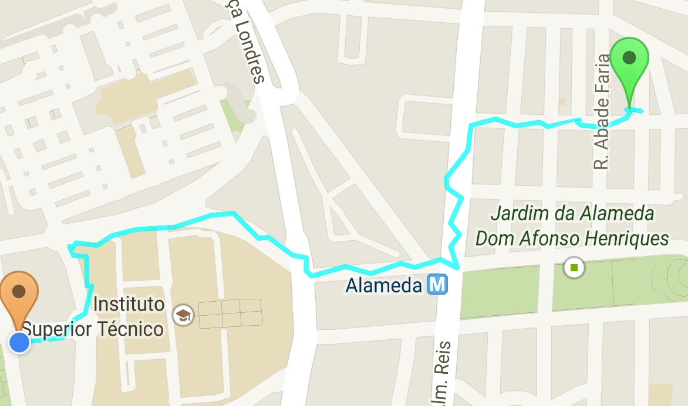

# Scout
CycleOurCity goes Mobile - Scout

## Index
* [Mobile Sensing](#mobile-sensing)

## Funf-OpenSensing Schedueling CheatSheet

* `"duration":0` : com a duração da tarefa de uma probe definida a 0 então essa tarefa é iniciada mas nunca terminada.
* `"strict":true`: garante que a tarefa de uma probe é realizada de acordo com a especificação do `interval`
* `"offset":0`	 : força a que a tarefa da probe se realize imediatamente.

*** 

## Mobile Sensing

The <a href="./javadoc/pt/ulisboa/tecnico/cycleourcity/scout/mobilesensing/MobileSensingPipeline.html">`MobileSensingPipeline`</a> is one of Scout's core components. and is responsible for connection the sensor captured data, gathered Funf's sensor probes, and the respective sensor pre-processing pipelines. This component is designed as a singleton, meaning that at each moment there is only a single instance in the application's scope, which is accessible to every Scout component.

The `MobileSensingPipeline` is designed to run a fixed rate, every few seconds (currently every 5s), once a sensing session has been initiated. At each iteration the `MobileSensingPipeline` dispatches all enqueue sensor samples to each sensor specific pipeline, in order to process thoses samples. Each sensor pipeline is executed asynchronously, as to avoid compromising the user's experience.

Besides working as a bridge between the sensor captured data and the sensor processing pipelines, the `MobileSensingPipeline` also operates as bridge between the application and the `StorageManager`.

Fig. 1 - `MobileSensingPipeline` architectural overview.

### LocationPipeline

The <a href="./javadoc/pt/ulisboa/tecnico/cycleourcity/scout/mobilesensing/sensorpipeline/location/LocationPipeline.html">`LocationPipeline`</a> is a sensor specific pipeline responsible for processing location samples.

This pipeline has two main purposes:

* Handling locations, used to geo-tag other samples;
* Extracting the travelled route's slope.

>Despite being a sensor specific pipeline, the `LocationPipeline` actually handles sensor data originated from two probes, the `LocationProbe` and the `PressureSensorProbe`. At an early stage it was determined that the altitudes registered by the GPS are too unreliable. Because the extraction of a route's slope was, from the beginning, one of this project's main purposes another solution had to be found. Two alternatives, to the GPS registered altitude were found:

>* The pitch or roll (depending if the device is respectively in portrait or landscape mode), derived from a `RotationSensorProbe`
* The altitude derived by Android's `SensorManager` from the measured atmospheric pressure, gathered by a `PressureSensorProbe`

>Because the second one provided more reliable altitudes, the `PressureSensorProbe` was chosen, although it should be noted that the fact that this is still a novel sensor could restrict the participation of older devices. As such further studies should be performed to allow all devices to participate.     

The `LocationPipeline`'s behaviour is determined by it's stages. More specifically this pipeline contemplates the following stages.

 * __DispatchSensorSamplesStage:__ Given all the sensor samples provided by the `MobileSensingPipeline`, this stage divides those samples into two groups, according to the sensor that generated them. Once the samples are divided, each group of samples is passed to a sensor specific pipeline, which can be either the `LocationSensorPipeline` or the `PressureSensorPipeline`. Then each of those two pipelines is executed. Meanwhile this stage waits for both the sensor specific pipelines to run. Once both have finished, the results from both sensor specific pipelines are then passed onto the next stage.
 * __MergeStage:__ This stage is responsible for merging all samples originated from different sensor probes, manages by this pipeline, as this is a nested pipeline. Given that this is a `LocationPipeline`, the most important samples are the location samples, however at each iteration of the pipeline, more pressure-based samples are generated. Additionally the location and pressure timestamps conform to a different format, making it impossible to establish a close relationship, given a time frame. Due to this challenges the `LocationPipeline` opts to maintain all location samples, and distributes pressure-based samples among the different locations. Given that the overall strategy is quite different from that of the `stages.MergeStage`, the `LocationPipeline` specifies its own `MergeStage`.
 * __FeatureExtractionStage:__ This stage is responsible for deriving the slope. The slope feature is derived based on a previous and current location, the distance travelled between those two points and the altitude differences between them.
 * __UpdateScoutStateStage:__ Given the results of the previous stages, this stage updates the application's internal state.
 * __GPXBuildStage:__ Updates the `GPXBuilder`'s track points, which will then be used to create a `.gpx` file that can be used to preview the travelled route.
 * __FeatureStorageStage:__ This stage operates as a callback function. It extracts the output from the PipelineContext, which contains the extracted features and travelled locations, and stores it on the application's storage manager.

#### Sensor Specific Pipelines

#### AdmissionControlStage

The information captured by the location sensors varies in quality. In order to assure the application's robustness the AdmissionControl stage removes samples that may undermine the quality of the system, for example samples of lower quality.

On an initial version this was achieved by a simple but unnefective heuristic where all location samples with an accuracy below
a pre-defined value where discarded. The accuracy provided by the location sensor's readings represents and error margin in meters, where for example, a sample with 40m of accuracy represents a location that can be found inside of a 40m radius from the estimated location.

##### HeuristicsAdmissionControlStage

De forma a aumentar a robustez das localizações capturadas pelo `LocationPipeline`, houve a necessidade de melhorar o processo de controlo de admissões. Com isto em mente foi criada a `HeuristicsAdmissionControlStage` onde um conjunto de heuristicas são aplicadas de forma a remover localizações, capturadas pelo receptor GPS, que possam comprometer a precisão do mesmo.

Assim e de forma a permitir a identificação e remoção de possíveis outliers são aplicadas as seguiintes heurísticas:
* __Heurística 1 :__ Margem de erro demasiado elevada

   A localização deve ter uma margem de erro inferor a um determinado limite pré-definido (`LocationState.MIN_ACCURACY`).

* __Heurística 2 :__ Velocidade irrealística

   A velocidade registada pelo receptor GPS, para uma dada localização, não deve ultrapassar um valor pré-definido (`LocationState.MAX_SPEED`).

* __Heurística 3 :__ Fixado a três satélites

   De forma a que seja possível realizar triângulação, e consequentemente identificar a posição do dispositivo, o receptor de GPS deve estar fixado com pelo menos 3 satélites, caso contrário a localização deverá ser discartada.

   Adicionalmente e dependendo do número de satélites usados para determinar a localização são aplicadas as seguintes correcções:
   * Com 3 satélites embora seja possível identificar a posição (lat & lon), não é recomendado assumir como correcto os valores da altitude e da velocidade, e como tal estes tomam como valor a média registada pelo `ScoutState`.
   * Com 4 satélites a altitude já pode ser aceite, no entanto a velocidade toma como valor a média registada pelo `ScoutState`. 

* __Heurística 4 :__ Grande variância na altitude

   Caso exista uma grande diferença entre a altitude registada pelo receptor GPS e da média das altitudes (valor definido pelo `ScoutState`), nomeadamente caso essa diferença ultrapasse um valor pré-definido (`LocationState.ALTITUDE_VARIANCE_THRESHOLD`) então a localização deve ser discartada.

   Esta heurística levanta um problema, caso a média de altitudes definida pelo `ScoutState` esteja "envenenada" existe a possibilidade de localizações correctas serem discartadas. Assim e de forma a resolver este problema, caso um número elevado de localizações sejam discartadas devido a esta heurística, a média das altitudes é reiniciada permitindo ao sistema corrigir-se a si próprio.

* __Heurística 5 :__ Velocidade calculada demasiado elevada

   Dadas duas posições consecutivas A e B, se o tempo necessário para chegar de A a B é muito baixo, i.e. a velocidade é muito elevada então B é considerado um outlier e discartado.

* __Heurística 6 :__ Velocidade calculada avançada demasiado elevada [Tripzoom] [TODO]
   
   Dadas três posições consecutivas A, B e C, se o tempo necessária para chegar de A a C através de B é muito baixo, i.e. a velocidade é muito elevada então B é considerado um outlier.

* __Heurística 7 :__ Sobreposição de áreas de incerteza [Tripzoom]

   Dadas duas posições consecutivas A e B e as duas margens de erro a e b (+/- x m), se as áreas das localizações se sobrepõem e a precisão de B é inferior que a de A, i.e. o raio de incerteza é maior em B, então B é considerado um outlier e discartado.

   
   
<emph>Track capturada pela aplicação com controlo de admissão por heurísticas.</emph>

