# Importante

Android API 5, da qual faz parte o projecto Volta, contempla um conjunto de novas ferramentas e componentes para optimizar os consumos energéticos das aplicações. Uma dessas classes é o `JobSchedueler`:
	JobScheduler API that lets you optimize battery life by defining jobs for the system to run asynchronously at a later 	time or under specified conditions (such as when the device is charging). Job scheduling is useful in such situations as:

	The app has non-user-facing work that you can defer.
	The app has work you'd prefer to do when the unit is plugged in.
	The app has a task that requires network access or a Wi-Fi connection.
	The app has a number of tasks that you want to run as a batch on a regular schedule.

# Scout
CycleOurCity goes Mobile - Scout

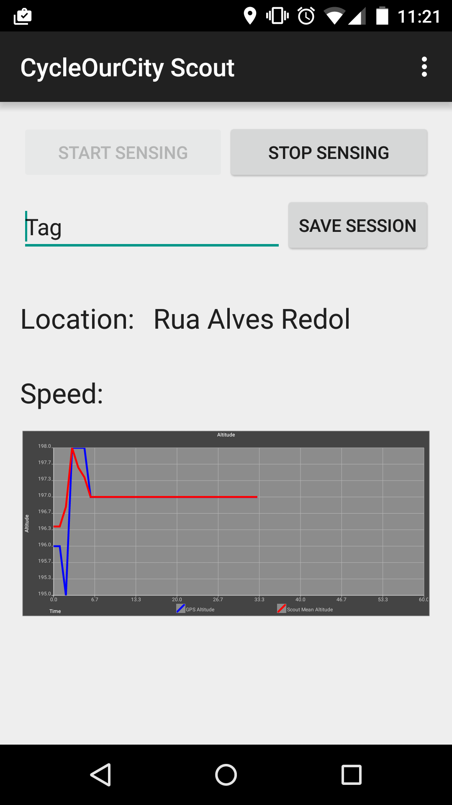

----------
##TODO
- [x] Migrar package `MobileSensing` para Java nativo
   - [x] Criar simulador, que usando as funcionalidades de `MobileSensing`, replica o funcionamento da aplicação
   - [x] Testar simulador
   - [ ] Melhorar a lib `MobileSensing` ao nível do *adaptive offloading*.
- [x] Implementar arquitectura cliente-servidor
   - [x] Criar web-service para receber as amostras sensoriais
   - [ ] Implementar componente na aplicação Scout, responsável pelo envio das amostras
   - [x] Lançar web-service **LANÇADO NO CLOUD SERVICE HEROKU**
   - [ ] Modificar o web-service de forma a que este lide com objectos JSON (actualmente este está a lidar apenas com Strings)
- [ ] Implementar o componente `AdaptiveOffloadinManager`
   - [ ] Estudar como realizar a monitorização dos recursos do dispositivo 

----------

## Index
* [Mobile Sensing](#mobile-sensing)

## Funf-OpenSensing Schedueling CheatSheet

* `"duration":0` : com a duração da tarefa de uma probe definida a 0 então essa tarefa é iniciada mas nunca terminada.
* `"strict":true`: garante que a tarefa de uma probe é realizada de acordo com a especificação do `interval`
* `"offset":0`	 : força a que a tarefa da probe se realize imediatamente.

*** 

## Mobile Sensing

The <a href="./ScoutApp/javadoc/pt/ulisboa/tecnico/cycleourcity/scout/mobilesensing/MobileSensingPipeline.html">`MobileSensingPipeline`</a> is one of Scout's core components. and is responsible for connection the sensor captured data, gathered Funf's sensor probes, and the respective sensor pre-processing pipelines. This component is designed as a singleton, meaning that at each moment there is only a single instance in the application's scope, which is accessible to every Scout component.

The `MobileSensingPipeline` is designed to run a fixed rate, every few seconds (currently every 5s), once a sensing session has been initiated. At each iteration the `MobileSensingPipeline` dispatches all enqueue sensor samples to each sensor specific pipeline, in order to process thoses samples. Each sensor pipeline is executed asynchronously, as to avoid compromising the user's experience.

Besides working as a bridge between the sensor captured data and the sensor processing pipelines, the `MobileSensingPipeline` also operates as bridge between the application and the `StorageManager`.

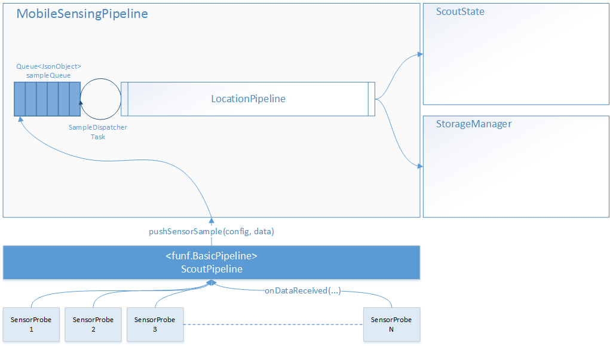
Fig. 1 - `MobileSensingPipeline` architectural overview.

### LocationPipeline

The <a href="./ScoutApp/javadoc/pt/ulisboa/tecnico/cycleourcity/scout/mobilesensing/sensorpipeline/location/LocationPipeline.html">`LocationPipeline`</a> is a sensor specific pipeline responsible for processing location samples.

This pipeline has two main purposes:

* Handling locations, used to geo-tag other samples;
* Extracting the travelled route's slope.

>Despite being a sensor specific pipeline, the `LocationPipeline` actually handles sensor data originated from two probes, the `LocationProbe` and the `PressureSensorProbe`. At an early stage it was determined that the altitudes registered by the GPS are too unreliable. Because the extraction of a route's slope was, from the beginning, one of this project's main purposes another solution had to be found. Two alternatives, to the GPS registered altitude were found:

>* The pitch or roll (depending if the device is respectively in portrait or landscape mode), derived from a `RotationSensorProbe`
* The altitude derived by Android's `SensorManager` from the measured atmospheric pressure, gathered by a `PressureSensorProbe`

>Because the second one provided more reliable altitudes, the `PressureSensorProbe` was chosen, although it should be noted that the fact that this is still a novel sensor could restrict the participation of older devices. As such further studies should be performed to allow all devices to participate.     

The `LocationPipeline`'s behaviour is determined by it's stages. More specifically this pipeline contemplates the following stages.

 * __DispatchSensorSamplesStage:__ Given all the sensor samples provided by the `MobileSensingPipeline`, this stage divides those samples into two groups, according to the sensor that generated them. Once the samples are divided, each group of samples is passed to a sensor specific pipeline, which can be either the `LocationSensorPipeline` or the `PressureSensorPipeline`. Then each of those two pipelines is executed. Meanwhile this stage waits for both the sensor specific pipelines to run. Once both have finished, the results from both sensor specific pipelines are then passed onto the next stage.
 * __MergeStage:__ This stage is responsible for merging all samples originated from different sensor probes, manages by this pipeline, as this is a nested pipeline. Given that this is a `LocationPipeline`, the most important samples are the location samples, however at each iteration of the pipeline, more pressure-based samples are generated. Additionally the location and pressure timestamps conform to a different format, making it impossible to establish a close relationship, given a time frame. Due to this challenges the `LocationPipeline` opts to maintain all location samples, and distributes pressure-based samples among the different locations. Given that the overall strategy is quite different from that of the `stages.MergeStage`, the `LocationPipeline` specifies its own `MergeStage`.
 * __FeatureExtractionStage:__ This stage is responsible for deriving the slope. The slope feature is derived based on a previous and current location, the distance travelled between those two points and the altitude differences between them.
 * __UpdateScoutStateStage:__ Given the results of the previous stages, this stage updates the application's internal state.
 * __GPXBuildStage:__ Updates the `GPXBuilder`'s track points, which will then be used to create a `.gpx` file that can be used to preview the travelled route.
 * __FeatureStorageStage:__ This stage operates as a callback function. It extracts the output from the PipelineContext, which contains the extracted features and travelled locations, and stores it on the application's storage manager.

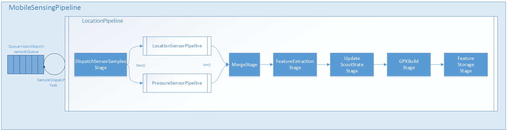

Fig. 2 - `LocationPipeline` architectural overview.

#### Sensor Specific Pipelines

##### LocationSensorPipeline

The `LocationSensorPipeline` is the pipeline responsible for processing samples originated from either a `LocationProbe` or a `SimpleLocationProbe`. It is its responsibility to assure the quality of the gathered location, as the GPS is a very unreliable sensor.

**Fig. 3 -** `LocationSensorPipeline` architectural overview
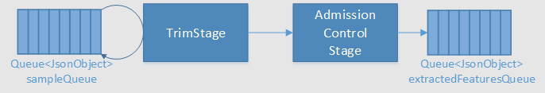

This pipeline is characterized by the following stages:

* __TrimStage:__ Removes certain data fields from the location sample that have no value to the application.
* __MergeStage:__ Appends location samples considered to be closely related, that is, samples that have both occurred inside a small time window frame.
* __HeuristicsAdmissionControlStage:__ This is possibly the most important stage, as this is the stage responsible for assuring the quality of the gathered locations. Due to the importance of this stage, the `HeuristicsAdmissionControlStage` will further detailed next.
* __FeatureExtractionStage:__ This stage does not actually does anything, it converts the input into output. __!!!CORRECT!!!__

The information captured by the location sensors varies in quality. In order to assure the application's robustness the `AdmissionControl` stage removes samples that may undermine the quality of the system, for example samples of lower quality.

On an initial version this was achieved by a simple but unnefective heuristic where all location samples with an accuracy below a pre-defined value were discarded. The accuracy provided by the location sensor's readings represents and error margin in meters, where for example, a sample with 40m of accuracy represents a location that can be found inside of a 40m radius from the estimated location. However the accuracy is subjective and not an ideal metric for outlier removal, as is noted by the Android's documentation:

> We define accuracy as the radius of 68% confidence. In other words, if you draw a circle centered at this location's latitude and longitude, and with a radius equal to the accuracy, then there is a 68% probability that the true location is inside the circle.

> In statistical terms, it is assumed that location errors are random with a normal distribution, so the 68% confidence circle represents one standard deviation. Note that in practice, location errors do not always follow such a simple distribution.

> This accuracy estimation is only concerned with horizontal accuracy, and does not indicate the accuracy of bearing, velocity or altitude if those are included in this Location.

> If this location does not have an accuracy, then 0.0 is returned. All locations generated by the LocationManager include an accuracy.

> __SEE__ <a href="http://developer.android.com/reference/android/location/Location.html#getAccuracy()">Location.getAccuracy()</a>

This lack of confidence resulted in a high number of outliers. In order to improve the outlier detection process, that is the admission control, the `HeuristicsAdmissionControlStage` was designed. This stage works as a pipeline based on heuristics, which define rules that specify which samples are acceptable or outliers. 

Currently the `HeuristicsAdmissionControlStage` supports several heuristics, which due to the pipeline design can be easily removed on interchanged. The following heuristics are supported:

* __AccuracyOutlier:__ removes samples with a high error margin.
* __SatellitesOutlier:__ removes samples that are not fixed to enough satellites. It should be noted that in order to assure positioning the sample must be fixed to at least 3 satellites (minimum required to perform triangulation), however ideally it should be fixed to at least 4 satellites.
* __GPSSpeedOutlier [NOT WORKING]:__ removes samples with a high registered speed. 
* __HighAltitudeOutlier [DEPRECATED]:__ removes samples with a high altitude variance. As currently the altitude is derived from the pressure probe there is no use for this heuristic. Additionally and due to the volatile nature of GPS's altitudes this heuristic was prone to state poisoning.
* __HighTravelSpeedOutlier:__ removes samples with a high calculated speed.
* __OverlappingLocationsOutlier:__ removes a sample if it's uncertainty area overlaps the previous location uncertainty area, and if the new location has a lower accuracy.

Although this new admission control process was a great improvement, in comparison with the previous it should be noted that it still lacks in precision, and further studies are required.

**Fig. 4 -** Track01 with good precision
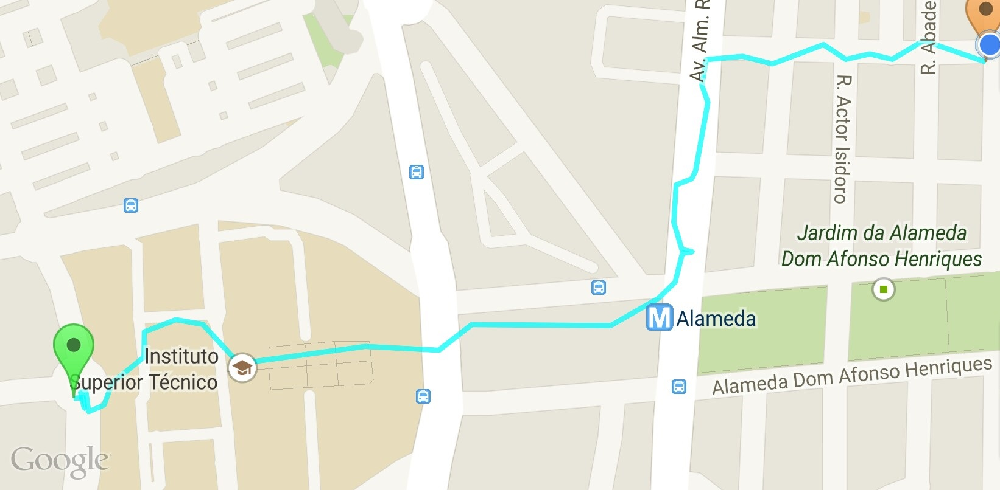
	

**Fig. 5 -** Track02 with average to low precision
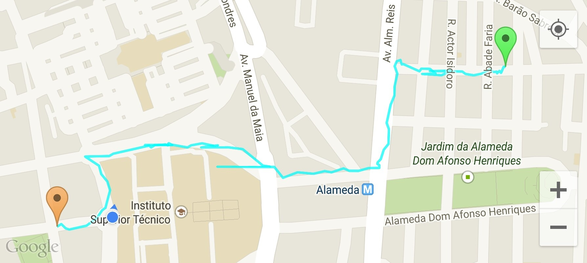

##### PressureSensorPipeline

The creation of the `PressureSensorPipeline` arose, as was explained before, due to the need to gather more reliable elevation values. Because Android's `SensorManager` offers a method which derives altitude from pressures, the use of the `PressureSensorProbe` presented itself as a good alternative to the GPS's altitudes.

> `public static float getAltitude (float p0, float p)`

>Computes the Altitude in meters from the atmospheric pressure and the pressure at sea level.

>Typically the atmospheric pressure is read from a TYPE_PRESSURE sensor. The pressure at sea level must be known, usually it can be retrieved from airport databases in the vicinity. If unknown, you can use PRESSURE_STANDARD_ATMOSPHERE as an approximation, but absolute altitudes won't be accurate.

>To calculate altitude differences, you must calculate the difference between the altitudes at both points. If you don't know the altitude as sea level, you can use PRESSURE_STANDARD_ATMOSPHERE instead, which will give good results considering the range of pressure typically involved.

> **SEE** <a href="http://developer.android.com/reference/android/hardware/SensorManager.html#getAltitude(float, float)">SensorManager.getAltitude(float p0, float p)</a>

The `PressureSensorPipeline` is characterized by two pipeline stages:

* __MergeStage:__ Merges samples considered to be closely related, that is, samples that have all occurred inside the same time window frame. The merger is performed by averaging all the registered pressures.
* __FeaturedExtractionStage:__ This stage is responsible for deriving the altitude from the measured atmospheric pressure.  

**Fig. 6 -** `PressureSensorPipeline` architectural overview
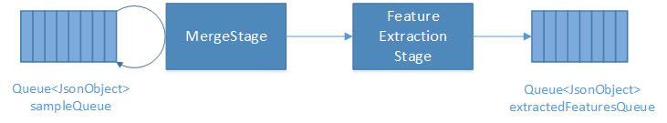

**Fig. 7 -** Altitudes from **Track01** derived from the GPS
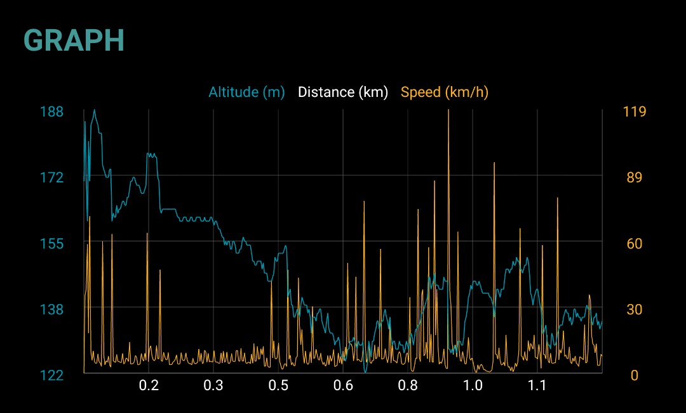

**Fig. 8 -** Altitudes from **Track01** derived from the atmospheric pressure
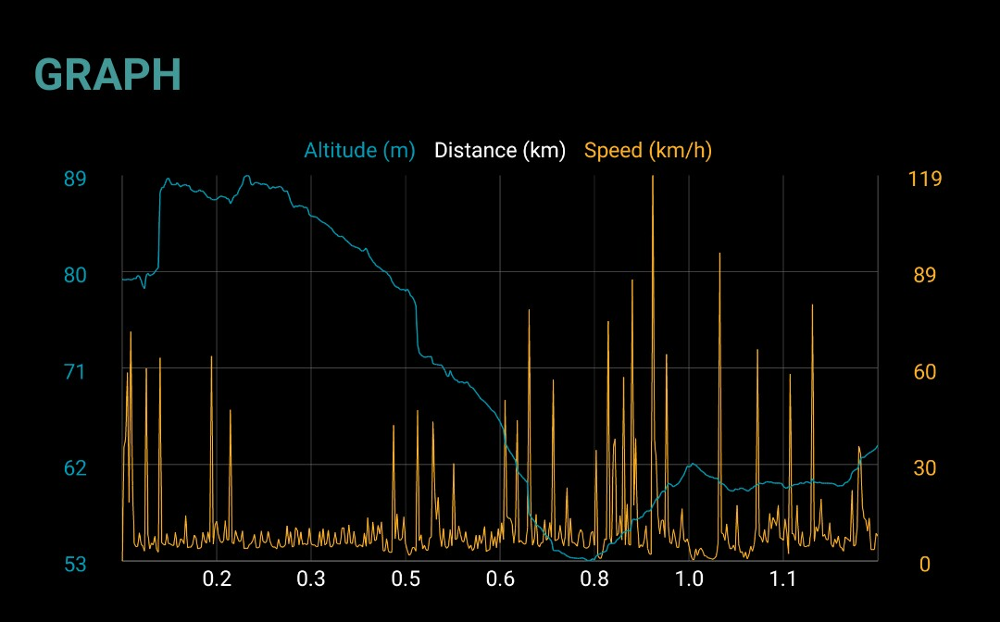

**Fig. 9 -** Altitudes from **Track02** derived from the GPS
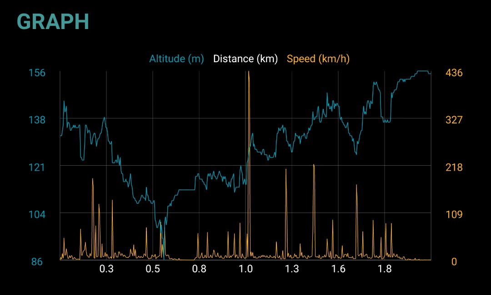

**Fig. 10 -** Altitudes from **Track02** derived from the atmospheric pressure
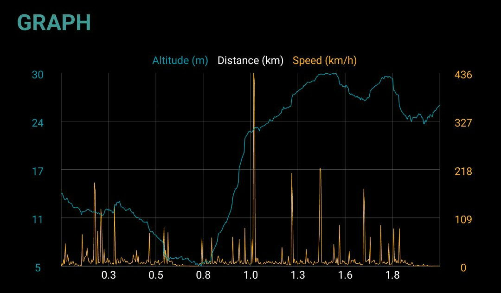

>**IMPORTANT**

>It should be noted that as the atmospheric pressure changes so do the derived altitudes, however since the pressure does not change that fast it should be consistent enough for one ride. Additionally since it is not the altitude the application is interested in but the slope, even if the atmospheric pressure changes the slope should hold. Further testing will be required to assure these properties.

