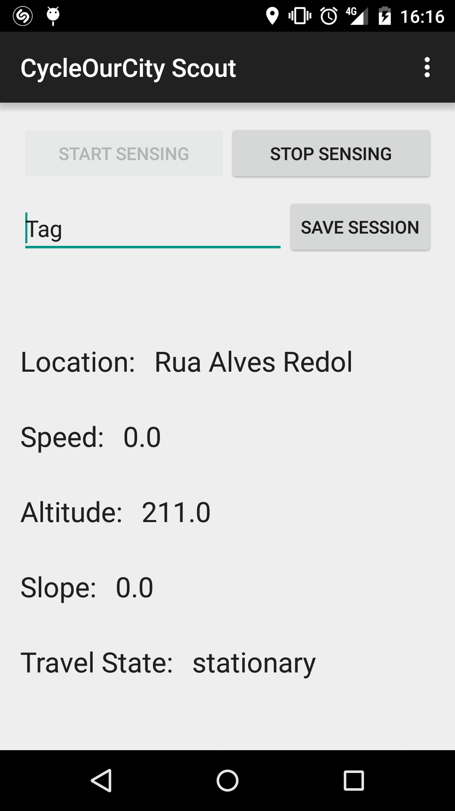

# Scout
CycleOurCity goes Mobile - Scout

## TODO

- [ ] Estudar como optimizar a precisão da elevação capturada pelo GPS.
- [ ] Estudar melhor como pode ser realizada a extracção da aceleração linear.
      - [ ] Low-pass Filter vs High-pass Filter vs No-Filter
- [ ] Criação de um classificador capaz de distinguir entre dispositivo estacionario e em movimento.
      - [ ] Criar|Procurar script que transforme amostras `.json` em formato `.arff`
      - [ ] Criar uma base de dados classificada, para treino do classificador
- [ ] Documentar as classes criadas
- [x] Criar módulo para criação de ficheiros GPX
- [x] Estudar o problema da segmentação de sequências contínuas de sinais.
- [x] Tornar assíncrono o processo de arquivação (Desnecessário)
- [x] Extracção de features no `LocationPipeline`
      - [x] Fazer merge de amostras de localização "relacionadas"
      - [x] Obter distância viajada
	- [x] Obter declive (*Nota:* muito impreciso)

## Funf-OpenSensing Schedueling CheatSheet

* `"duration":0` : com a duração da tarefa de uma probe definida a 0 então essa tarefa é iniciada mas nunca terminada.
* `"strict":true`: garante que a tarefa de uma probe é realizada de acordo com a especificação do `interval`
* `"offset":0`	 : força a que a tarefa da probe se realize imediatamente.

## Open Issues

### ISSUE 04102:VoidMotionSignals
Estão a ser armazenadas amostras de sensores de movimento vazios no `AccelerometerPipeline`. Este problema deve-se a um bug na executação da `FeatureExtractionStage` onde as features estão a ser construídas independentemente da existência ou não de amostras.

Com o passar do tempo a aplicação vai perdendo performance. Mesmo sem uma sessão de sensing iniciada a aplicação está a consumir muitos recursos (GC constantemente a ser chamado). É assim necessário realizar um estudo de quais os possíveis pontos de optimização.

### ISSUE 04111:Haversine

## Recently Solved Issues

### ISSUE 07041:Scheduler
O problema foi "resolvido" através da especificação do valor da duração das tarefas das probes como sendo 0 (`"duration":0`). Embora isto funcione bem para a `AccelerometerSensorProbe` e para a `GravitySensorProbe`, a sampling rate da `LocationProbe` ainda deixa a desejar.

### ISSUE 04103:UnexpectedCrash
Por vezes, ao iniciar pela primeira vez uma sessão de sensing, a aplicação crasha de forma inesperada. Após a análise do BUG report, gerado pelo dispositivo, foram identificados várias excepções fatais causadas por uma NullPointerException. Esta é sempre causada em `LocationPipeline.java:188`, quando é chamado o método `JsonElement.getAsString` sobre um objecto não existente. Esta excepção ocorre quando o provider da localização é a rede e o método acede ao JsonElemente "extras", que por sua vez é não existente.

A solução para este problema passa assim por verificar se o campo "extras" existe ou não e apenas caso este exista são adicionados os campos especiais à nova amostra.

### ISSUE 07043:EmptyDB
Havia um bug no método `ScoutArchive.getDelegateArchive()`, em que caso o `delegateArchive` já existisse `null` era retornado.

### ISSUE 04104:LazyApp
O problema estava na forma como o consumo do estado e posterior actualização estavam a ser realizados. A TimerTask foi assim substituída por um `Runnable` invocado por um `Handler` (`handler.postDelayed(runnable, interval)`). 

## Mobile Sensing

### LocationPipeline

#### AdmissionControlStage

The information captured by the location sensors varies in quality. In order to assure the application's robustness the AdmissionControl stage removes samples that may undermine the quality of the system, for example samples of lower quality.

On an initial version this was achieved by a simple but unnefective heuristic where all location samples with an accuracy below
a pre-defined value where discarded. The accuracy provided by the location sensor's readings represents and error margin in meters, where for example, a sample with 40m of accuracy represents a location that can be found inside of a 40m radius from the estimated location.

##### HeuristicsAdmissionControlStage

De forma a aumentar a robustez das localizações capturadas pelo `LocationPipeline`, houve a necessidade de melhorar o processo de controlo de admissões. Com isto em mente foi criada a `HeuristicsAdmissionControlStage` onde um conjunto de heuristicas são aplicadas de forma a remover localizações, capturadas pelo receptor GPS, que possam comprometer a precisão do mesmo.

Assim e de forma a permitir a identificação e remoção de possíveis outliers são aplicadas as seguiintes heurísticas:
* Heurística 1 : Margem de erro demasiado elevada

   A localização deve ter uma margem de erro inferor a um determinado limite pré-definido (`LocationState.MIN_ACCURACY`).

* Heurística 2 : Velocidade irrealística

   A velocidade registada pelo receptor GPS, para uma dada localização, não deve ultrapassar um valor pré-definido (`LocationState.MAX_SPEED`).

* Heurística 3 : Fixado a três satélites

   De forma a que seja possível realizar triângulação, e consequentemente identificar a posição do dispositivo, o receptor de GPS deve estar fixado com pelo menos 3 satélites, caso contrário a localização deverá ser discartada.

   Adicionalmente e dependendo do número de satélites usados para determinar a localização são aplicadas as seguintes correcções:
   * Com 3 satélites embora seja possível identificar a posição (lat & lon), não é recomendado assumir como correcto os valores da altitude e da velocidade, e como tal estes tomam como valor a média registada pelo `ScoutState`.
   * Com 4 satélites a altitude já pode ser aceite, no entanto a velocidade toma como valor a média registada pelo `ScoutState`. 

* Heurística 4 : Grande variância na altitude

   Caso exista uma grande diferença entre a altitude registada pelo receptor GPS e da média das altitudes (valor definido pelo `ScoutState`), nomeadamente caso essa diferença ultrapasse um valor pré-definido (`LocationState.ALTITUDE_VARIANCE_THRESHOLD`) então a localização deve ser discartada.

   Esta heurística levanta um problema, caso a média de altitudes definida pelo `ScoutState` esteja "envenenada" existe a possibilidade de localizações correctas serem discartadas. Assim e de forma a resolver este problema, caso um número elevado de localizações sejam discartadas devido a esta heurística, a média das altitudes é reiniciada permitindo ao sistema corrigir-se a si próprio.

* Heurística 5 : Velocidade calculada demasiado elevada

   Dadas duas posições consecutivas A e B, se o tempo necessário para chegar de A a B é muito baixo, i.e. a velocidade é muito elevada então B é considerado um outlier e discartado.

* Heurística 6 : Velocidade calculada avançada demasiado elevada [Tripzoom] [TODO]
   
   Dadas três posições consecutivas A, B e C, se o tempo necessária para chegar de A a C através de B é muito baixo, i.e. a velocidade é muito elevada então B é considerado um outlier.

* Heurística 7 : Sobreposição de áreas de incerteza [Tripzoom]

   Dadas duas posições consecutivas A e B e as duas margens de erro a e b (+/- x m), se as áreas das localizações se sobrepõem e a precisão de B é inferior que a de A, i.e. o raio de incerteza é maior em B, então B é considerado um outlier e discartado.

